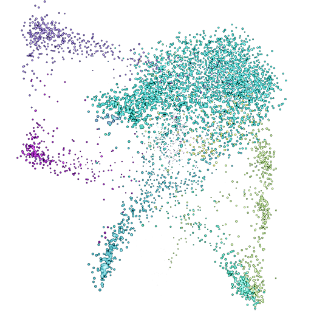
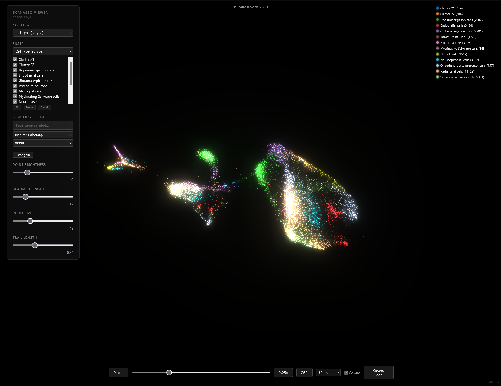

<p align="center">
  
</p>

# scAnimator

Interactive WebGL visualization of single-cell RNA sequencing data. Points are rendered as glowing light sources on a black background, with continuous UMAP warping that smoothly interpolates between different embedding parameterizations.

<p align="center">
  
</p>
<p align="center"><a href="https://github.com/GSNautilus/scAnimator/releases/download/v1.0.1/umap_warp_demo.webm">Download demo video (51MB)</a></p>

## Features

- **Continuous UMAP warping** — Sweeps `n_neighbors` (5-150) with Procrustes-aligned keyframes and cubic spline interpolation for smooth, mathematically meaningful transitions
- **3D point cloud rendering** — Custom Three.js shaders with additive blending, UnrealBloomPass, and optional trail persistence (persistence of vision effect)
- **Color by metadata** — Switch between cell type annotations (scType), Seurat clusters, sample, region, or subgroup
- **Filter by metadata** — Show/hide cells by any metadata column with checkbox toggles
- **Gene expression overlay** — Type any gene symbol to visualize expression with continuous colormaps (viridis, magma, plasma, inferno), brightness modulation, or point size mapping
- **Gene autocomplete ranked by expression** — Suggestions sorted by total expression level with rank annotations
- **Legend with category toggle** — Click any category in the legend to show/hide those cells
- **360 auto-rotation** — Rotates around the camera's current up axis
- **Video recording** — Record animation loops as WebM with optional square crop
- **Adjustable rendering** — Point brightness, bloom strength, point size, trail length, FPS limiter

## Architecture

```
scRNAseq/
  build_viewer.py      # Python build script — generates all data files
  code.Rmd             # R analysis notebook (Seurat preprocessing)
  viewer/
    index.html         # Three.js WebGL viewer (single file, no build step)
    frames.bin         # Float32: animation frames (n_frames x n_cells x 3)
    colors.bin         # Float32: RGB per cell (n_cells x 3)
    expression.bin     # Uint8: all genes concatenated (28K genes x 45K cells)
    gene_index.json    # Byte offsets for HTTP Range requests into expression.bin
    gene_ranks.json    # Expression rank per gene (1 = highest)
    metadata.json      # Cell metadata, palettes, labels
```

### Data pipeline

1. **R** (code.Rmd) — Load Seurat object, run scType annotations, export PCA embeddings + sparse expression matrix + metadata to `export/`
2. **Python** (build_viewer.py) — Compute 3D UMAP keyframes at varying `n_neighbors`, Procrustes-align them, cubic spline interpolate, quantize expression to uint8, write binary files
3. **Browser** (viewer/index.html) — Load binary data via fetch, render with Three.js, gene expression fetched on demand via HTTP Range requests

### Rendering pipeline

- **Shader**: Custom `ShaderMaterial` with per-point color (`aColor`) and size (`aSize`) attributes. Fragment shader applies radial intensity falloff: `pow(1 - d*d, 1.5)`.
- **Bloom**: `UnrealBloomPass` for glow effect on additive-blended points
- **Trails**: Render target ping-pong — previous frame faded and composited via `max(old, new)`
- **Animation**: Accumulator-based frame stepping with configurable speed and FPS limiter

## Requirements

### R dependencies
- Seurat, scType, tidyverse

### Python dependencies
```
numpy
pandas
scipy
umap-learn
```

### Viewing
Any modern browser with WebGL2 support. Serve locally:
```bash
cd viewer
python -m http.server 8000
# Open http://localhost:8000
```

## Rebuilding

To regenerate the viewer data from the Seurat object:

1. Run the R notebook (`code.Rmd`) to export PCA, metadata, and expression to `export/`
2. Run the build script:
   ```bash
   python build_viewer.py
   ```
   This takes ~10 minutes (UMAP computation + expression quantization for 28K genes).

3. Optionally regenerate gene expression ranks:
   ```python
   # See inline script in build_viewer.py header comments
   ```

## License

MIT
